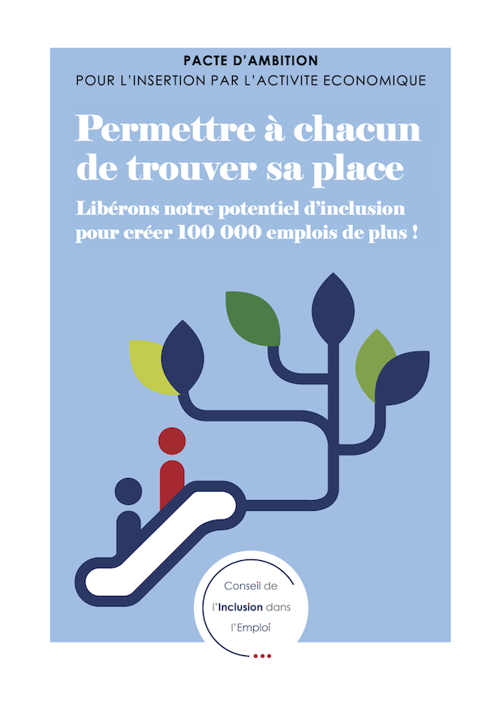

# 📚 Documentation sur les emplois de l'inclusion

Le site les emplois de l'inclusion a été conçu dans le cadre du [**Pacte IAE**](https://travail-emploi.gouv.fr/IMG/pdf/pacte_d_ambition_iae_sept_2019_synthese.pdf), un dispositif d’État pour l’**Inclusion par l’Activité Économique** **des personnes les plus éloignées de l’emploi** en raison de difficultés sociales, professionnelles, ou de santé.

C’est un **téléservice évolutif** porté par :

* Le [Haut-commissariat à l'inclusion dans l'emploi et à l'engagement des entreprises \(HCIEE\)](https://travail-emploi.gouv.fr/ministere/organisation/article/haut-commissaire-a-l-inclusion-dans-l-emploi-et-a-l-engagement-des-entreprises)
* La [Délégation générale à l’emploi et à la formation professionnelle \(DGEFP\)](https://travail-emploi.gouv.fr/ministere/organisation/organisation-des-directions-et-services/article/organisation-de-la-delegation-generale-a-l-emploi-et-a-la-formation)
* Les services [Pôle emploi](https://www.pole-emploi.fr/accueil/)
* Et accompagné par la [Direction Interministérielle au Numérique \(DINUM](https://www.numerique.gouv.fr/)\)

## En accès rapide : mes infos utiles 👇

 La [liste des prescripteurs habilités](pourquoi-une-plateforme-de-linclusion/qui-sont-les-differents-prescripteurs/prescripteur-habilite.md#liste-des-prescripteurs-habilites-en-national) au niveau national

 Les [critères d'éligibilité](qui-est-eligible-iae-criteres-eligibilite/#criteres-administratifs-de-niveau-1) à l'IAE

 Le [Diagnostic socio-professionnel](qui-est-eligible-iae-criteres-eligibilite/#diagnostic_de_reference)

 Le calendrier des [webinaires](rendez-vous-webinaires/)

 Le [Kit de communication](outils-information-communiation-de-la-plateforme/kit-de-communication/) 

              **Consulter le Pacte IAE** 👇 

\*\*\*\*

