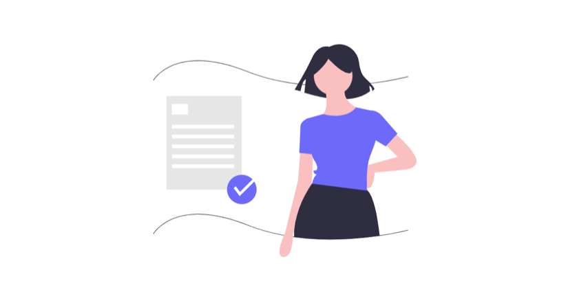

# Fonctionnalités employeur

La Plateforme me permet de **mettre en avant les postes sur lesquels j’ai besoin de recruter**, de **gérer plus facilement les candidatures** en ligne, **d'obtenir rapidement un agrément** si je suis une SIAE **\(**[**Pass IAE**](../pourquoi-une-plateforme-de-linclusion/pass-iae-agrement-plus-simple-cest-a-dire.md)**\)**. 

Le **recrutement est plus direct, plus simple, plus rapide** pour moi. Sur la page d’accueil je peux [**tester la Plateforme avant inscription**](https://inclusion.beta.gouv.fr/) et identifier les employeurs solidaires de ma ville qui sont déjà présents !

### Une fois inscrit, je pourrai :

 Faire une **présentation valorisante de ma structure et de ses filiales**

\*\*\*\* **Gérer les fiches de poste** \(code ROME et libellé alternatif plus précis, descriptif de poste\)

\*\*\*\* **Recevoir directement les candidatures** \(profil/message candidat, infos prescripteur…\)

\*\*\*\* **Traiter les candidatures/informer les intéressés** \(à l’étude, acceptées, pour plus tard, refusées\)

\*\*\*\* **Valider l’éligibilité d’une candidature** spontanée ou adressée par un prescripteur non-habilité\*

\*\*\*\* **Confirmer une embauche et obtenir automatiquement un** [**Pass IAE**]()**\*** via la Plateforme

_\* Dans le cas d'une SIAE._ 

\_\_


Un **candidat adressé par un prescripteur habilité est réputé éligible à l'IAE**. La SIAE n'a rien à faire.

Les [**GEIQ, EA, EATT**](../pourquoi-une-plateforme-de-linclusion/qui-sont-les-employeurs-solidaires.md#comment-se-reperer-entre-les-differents-employeurs-solidaires) **n’ont pas besoin de** [**Pass IAE**](../pourquoi-une-plateforme-de-linclusion/pass-iae-agrement-plus-simple-cest-a-dire.md) pour recruter un candidat. Ils ne sont pas soumis aux critères d'éligibilité.



[**Employeurs : des réponses à vos questions dans notre FAQ**]()\*\*\*\*


###   ****👉 ****[**Je suis employeur solidaire ? Je m'inscris sur la Plateforme**](https://inclusion.beta.gouv.fr/)\*\*\*\*

