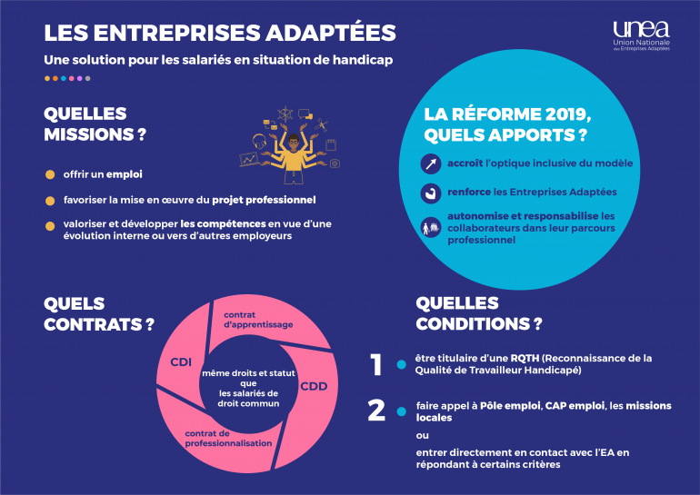

# ♿ Contrat en Entreprise Adaptée

## Qu'est-ce qu'une Entreprise Adaptée ?

Les entreprises adaptées \(EA\) et entreprises adaptées de travail temporaire \(EATT\) permettent à des personnes en situation de handicap d’accéder à l’emploi dans des conditions adaptées à leurs capacités. 

Elles les accompagnent dans leur projet professionnel et peuvent être une passerelle vers d’autres employeurs privés et publics.



## 2 modes de recrutement pour les EA/EATT: 

**1️⃣**[ Le recrutement par le biais du SPE \(Service Public de l’Emploi\)](contrat-en-entreprise-adaptee.md#1-criteres-deligibilite-ea-eatt-dans-le-cadre-dun-recrutement-via-le-spe)

2️⃣ [Le recrutement direct ](contrat-en-entreprise-adaptee.md#2-criteres-deligibilite-ea-eatt-dans-le-cadre-dun-recrutement-direct)


_Les orienteurs et autres prescripteurs habilités IAE peuvent orienter des candidats aux EA sur les emplois de l’inclusion mais ces recrutements seront considérés comme des “recrutements directs”._ 


## Qui peut intégrer une entreprise adaptée  ? 

Pour intégrer une EA/EATT, le candidat doit avoir : 

* **une RQTH** 
* et **répondre à un des critères** en fonction du mode de recrutement 

### **1️⃣ Critères d'éligibilité EA/EATT dans le cadre d'un recrutement via le SPE** \*

\*Service Public de l'Emploi = Cap emploi, Mission Locale, Pôle emploi

* Sans emploi depuis au moins 24 mois discontinus, dans les 48 derniers mois
* Niveau 3 ou infra, Peu ou pas qualifié, ou Sans diplôme,
* Bénéficiaires de minimas sociaux \(prioritairement bénéficiaires de l'allocation adulte handicapé \(AAH\),
* Sortants d’un établissement ou service d’aide par le travail \(ESAT\),
* Sortants d'ULIS PRO ou d'apprentissage adapté,
* Autres situations résultant de l'expertise technique du SPE \(notamment changement d'EA, sortant d'un établissement de santé, …\).
* Autres situations résultants de l’expertise technique du SPE
* Licenciés pour inaptitude avec un projet pro hors EA 


#### Focus sur les bénéficiaires de minima sociaux : 

* allocation supplémentaire d'invalidité \(ASI\)
* allocation de solidarité spécifique \(ASS\)
* Allocation demandeurs d’asile \(ADA\)
* allocation temporaire d'attente \(ATA\)
* allocation veuvage \(AV\)
* Revenu de solidarité outre-mer \(RSO\)
* Revenu de Solidarité active \(RSA\)
* allocation adulte handicapé \(AAH\)

Source : [instruction DGEFP du 21/02/2019](https://www.legifrance.gouv.fr/circulaire/id/44443)


### 2️⃣ **Critères d'éligibilité EA/EATT dans le cadre d'un recrutement direct**

* Bénéficiaires de l'allocation adulte handicapé \(AAH\)
* Sans emploi depuis au moins 24 mois continus ou discontinus, dans les 48 derniers mois
* Sortants d’un établissement ou service d’aide par le travail \(ESAT\)
* Sortants d'un centre de rééducation professionnelle \(CRP\)
* Sortants d'ULIS PRO
* Sortants d'apprentissage adapté
* Sortants d'institution ou service spécialisé \(IME, IEM, IMPRO, d’un service d’accompagnement médico- social pour adultes handicapés \(SAMSAH\) et Service d'accompagnement à la vie sociale \(SAVS\) avec un projet professionnel à consolider
* Ayant bénéficié d’un contrat d'apprentissage réalisé dans une Entreprise Adaptée
* Plus de 55 ans
* Bénéficiaire d’une pension d’invalidité catégorie 1 ou 2


👉 Plus d’informations sur les missions des EA/EATT [sur le site de l’UNEA.](https://www.unea.fr/quest-ce-quune-entreprise-adaptee)


