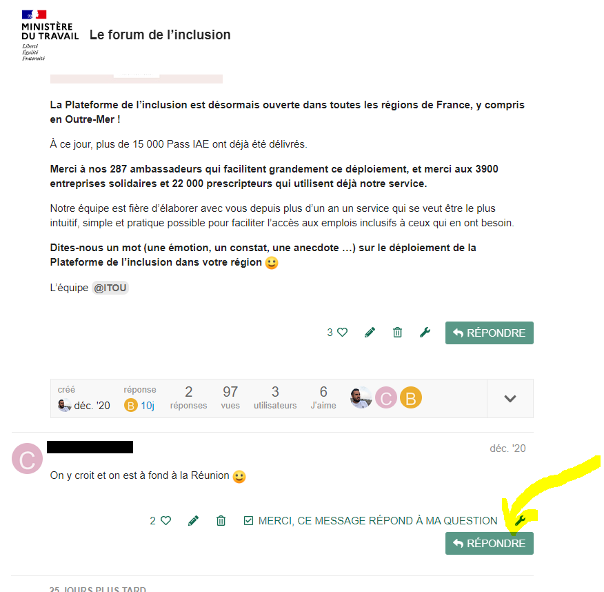

# Commentez un sujet


Pour commenter un sujet sur le Forum de l'inclusion il est nécessaire d'être inscrit et connecté.


### Une fois connecté,  sélectionnez le Sujet de votre choix

Une page affiche le sujet choisi.

### Pour commenter le Sujet posté par l'auteur

Cliquez sur répondre en dessous du sujet, comme sur l'image ci-dessous.

### 

### Pour répondre à un commentaire posté sur un sujet

Cliquez sur le bouton répondre sous le commentaire de votre choix.

