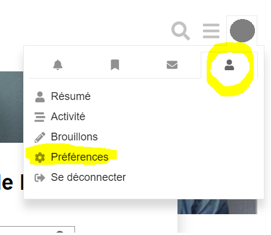
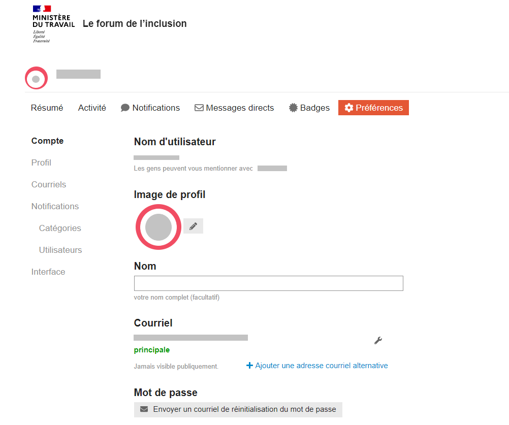

# Configurez votre profil

Afin de vous permettre d'être identifiés par les membres de la communauté, nous vous recommandons de compléter votre profil !

Lorsque vous êtes connectés sur le Forum de l'inclusion, suivez les étapes suivantes.

### Cliquez sur le rond de couleur en haut à droite du site

### Vos notifications s'affichent, cliquez sur l'image en forme de personnage.

Puis cliquez sur préférences comme sur l'image ci-dessous.

### Vous accédez aux paramètres de votre compte utilisateur

Complétez votre Nom, ajoutez une adresse email ou demandez un email de réinitialisation de votre mot de passe.

### A gauche de votre écran, cliquez sur Profil.

Renseignez les informations relatives à votre parcours professionnel ou associatif. Votre expertise et les connaissances que vous pouvez partager avec la communauté par exemple.

### Votre profil peut être modifié à tout moment en suivant ces étapes.

