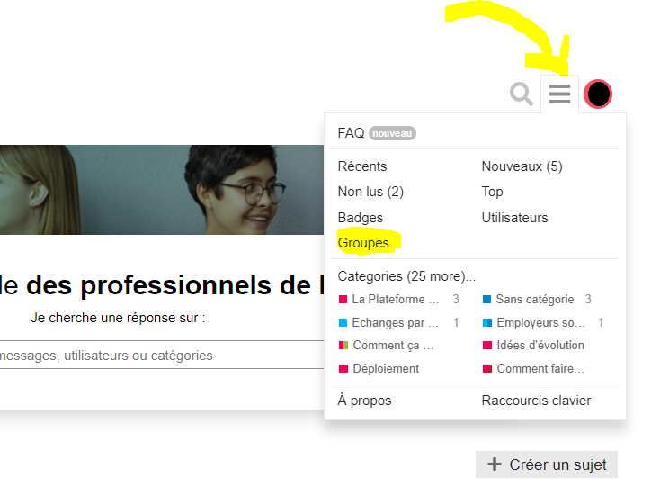

# Découvrez les groupes d'acteurs du Forum

Sur le Forum de l'inclusion, de nombreux acteurs de retrouvent pour échanger. 


Les groupes d'utilisateurs vous permettent d'accéder à des espaces d'échanges dédiés. 

Par exemple, seuls les membres de la Bande à ITOU ont accès à leur espace d'échanges dédié.


Pour découvrir les groupes existants sur le Forum de l'inclusion, suivez les étapes suivantes.

### Une fois connecté sur le Forum de l'inclusion, cliquez sur les trois traits en haut à droite du site.

Situés à gauche du rond de couleur avec votre initiale. Comme sur l'image ci-dessous.

Cliquez ensuite sur Groupes.

### Cet écran s'affiche

Vous avez la possibilité de demander à adhérer à un groupe existant si vous le souhaitez !


Si vous souhaitez créer votre groupe d'utilisateurs, vous pouvez contacter notre équipe en écrivant un message sur le Forum de l'inclusion. Pensez à tagger @Equipe\_Forum 😊


