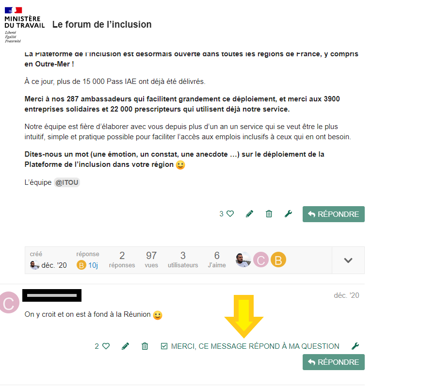

# Marquer vote sujet comme "résolu"

Le Forum vous permet entre autres, d'adresser des questions à la communauté. Pour comprendre le fonctionnement d'un service, d'une aide ou mesure à l'emploi par exemple.

Les membres de la communauté vous apportent leur expertise et leurs réponses.

Dès que vous avez obtenu une réponse satisfaisante, vous pouvez marquer votre Sujet comme "résolu".


Les sujets marqués comme résolus sont utiles à la communauté. Ils permettent d'identifier facilement si une question a déjà obtenu une réponse satisfaisante ou non.



Seuls les auteurs d'un sujet ont la possibilité d'identifier un commentaire comme répondant à la question. \
\
Les autres utilisateurs ont la possibilité de liker et commenter les différents commentaires pour apporter un éclairage ou soutenir un message.


Voici comment marquer votre sujet comme résolu en pas à pas.

### Une fois que vous avez rédigé un Sujet \[[Cliquez ici pour suivre les étapes](postez-un-sujet.md)]

Retrouvez les commentaires postés par la communauté dans vos notifications.

###

### Cliquez sur le rond de couleur en haut à droite du site

.png>)

### Vos notifications d'affichent.

Cliquez sur la notification de votre choix pour afficher le commentaire.

### Voici un exemple de sujet posté.

Cliquez sur le bouton "Merci ce message répond à ma question". Comme sur l'image ci-dessous.

