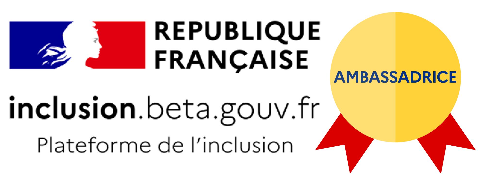

# 🚀La BANDE À ITOU !

Intégrer la **communauté des** [**ambassadeurs et ambassadrices**](pourquoi-une-plateforme-de-linclusion/devenir-ambassadrice-ambassadeur.md), c'est profiter de certains **privilèges** :

1. Être en **échange direct** avec l’équipe [**ITOU**](https://beta.gouv.fr/startups/itou.html) 
2. Découvrir les **informations en avant-première**
3. **Échanger entre pairs** au sein de la communauté 
4. **Partager** vos bonnes pratiques, vos idées, vos outils et supports de communication
5. Être **identifié comme ambassadeur et ambassadrice** par vos partenaires
6. **Participer à l'évolution** de la Plateforme \(groupes de travail, [**OpenLabs**](pourquoi-une-plateforme-de-linclusion/participer-a-la-plateforme-de-linclusion.md#les-openlab-sont-ouverts-a-tous), tests...\)

**Être ambassadeur ou ambassadrice volontaire**, c'est aussi accompagner la Plateforme de l'inclusion dans son déploiement : vous **organisez des réunions,** en autonomie ou avec d’autres membres de la communauté de votre zone \(région, département, ville\), **selon vos disponibilités**.  
  

### Vous êtes **libre de choisir les missions** pour lesquelles vous souhaitez vous impliquer : 

**COMMUNAUTÉ :**

* Faire partie d’une communauté décloisonnée des acteurs de l'inclusion
* Participer aux RDV mensuels de la BANDE À ITOU \(nouveautés, partage de solutions, Q/R\)
* Participer aux RDV mensuels "Démo & expérimentation" pour découvrir l'utilisation de la Plateforme de l'inclusion
* Représenter la Plateforme de l'inclusion \(sur Linkedin, le Forum de l'inclusion...\)
* Identifier les autres ambassadeurs / ambassadrices de son territoire
* S'impliquer dans l'intégration des nouveaux ambassadeurs / ambassadrices \(présentation, démonstration, accueil visio, échanges téléphoniques...\)
* Recruter d'autres ambassadeurs / ambassadrices sur ma zone pour compléter les expertises

**DÉPLOIEMENT :**

* Organiser une présentation en local / auprès de mon réseau
* Animer des webinars de déploiement sur mon département
* Co-animer des webinars de déploiement sur ma région
* Accompagner le SAV pour le déploiement de ma région / mon département / l'ensemble du territoire

**RETOURS UTILISATEURS / UTILISATRICES :**

* Participer aux[ **Openlabs**](pourquoi-une-plateforme-de-linclusion/participer-a-la-plateforme-de-linclusion.md#les-openlab-sont-ouverts-a-tous) / aux groupes de travail et de co-construction
* Être sollicité pour un feedback et/ou un test utilisateur
* Identifier les personnes sceptiques sur l'intérêt, l'utilité et/ou le fonctionnement de la Plateforme de l'inclusion

**PARTAGE :**

* Echanger des bonnes pratiques, rencontrer des pairs
* Partager vos outils et supports de communication auprès de la communauté


Vous souhaitez vous aussi **devenir** [**ambassadrice ou ambassadeur**](pourquoi-une-plateforme-de-linclusion/devenir-ambassadrice-ambassadeur.md) ****? 

👉 Nous vous invitons à [**remplir ce questionnaire**](https://docs.google.com/forms/d/e/1FAIpQLSdMqvNwnXX8CZ-LJuFl5MU4sYM-v-QLOXZJT87BNJZC9rF0rQ/viewform), laissez-vous ensuite guider ! Vous recevrez ensuite automatiquement les **invitations à nos rendez-vous**.



_Votre rôle est clé, un grand merci pour votre support dans le déploiement de la Plateforme de l’inclusion !_


\*\*\*\*

### Affichez votre statut d'ambassadrice /ambassadeur

#### Signature d'email ''Ambassadrice''



#### **Signature d'email ''Ambassadeur''**



