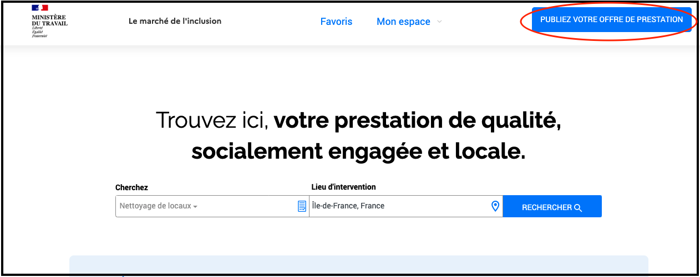
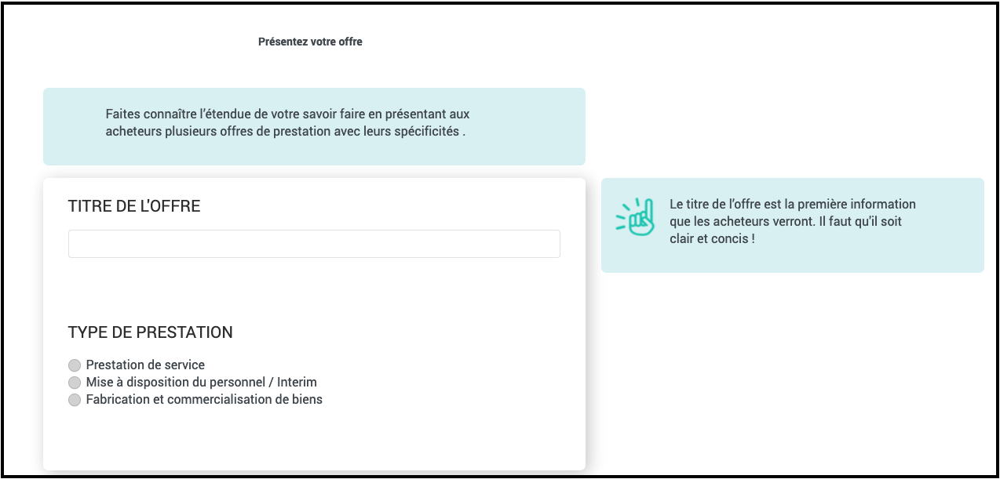

# Publier mon offre de prestation

**Avant de commencer, munissez-vous de photos représentatives de vos prestations.**

Quelques conseils pour une offre **claire** et **efficace** :

* Choisissez un titre simple qui indique clairement la prestation proposée
* Créez une annonce par type de prestation
* Illustrez votre annonce à l'aide de photos cohérente avec l'activité

Connectez-vous sur [le Marché de l'inclusion](https://lemarche.inclusion.beta.gouv.fr/fr/).

Cliquez en haut à droite sur le bouton "**Publiez votre offre de prestation**"

Suivez le processus pas à pas en vous laissant guider par les messages affichés : 

