# M'inscrire sur la Plateforme

Cliquez en haut à droite sur le bouton **"Se connecter" \[1\] ,** puis sélectionnez **"Prescripteur" \[2\] :**

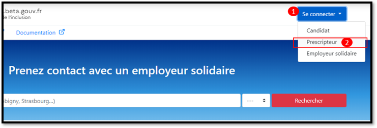

Puis cliquez sur **"Créer un compte prescripteur" :**

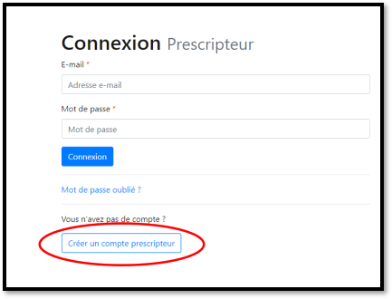

**Nous avons mis en place des processus d'inscription spécifiques à chaque organisation :**

📝[Voir le processus d'inscription pour un agent Pôle emploi](inscription-prescripteur.md#inscription-pour-un-agent-pole-emploi)

📝[Voir le processus d'inscription pour un prescripteur habilité au national](inscription-prescripteur.md#inscription-pour-un-prescripteur-habilite-au-national)

📝[Voir le processus d'inscription pour une organisation conventionnée par un Conseil   Départemental pour le suivi des bénéficiaires du RSA](inscription-prescripteur.md#inscription-pour-une-organisation-conventionnee-par-un-conseil-departemental-pour-le-suivi-des-beneficiaires-du-rsa)

📝[Voir le processus d'inscription pour un prescripteur habilité au niveau préfectoral](inscription-prescripteur.md#inscription-pour-un-prescripteur-habilite-au-niveau-prefectoral)

📝 [Voir le processus d'inscription pour un orienteur](inscription-prescripteur.md#inscription-pour-un-orienteur)

## Inscription pour un agent Pôle emploi

A la question _"Travaillez-vous pour Pôle emploi ? "_, cliquez sur **"Oui"** puis sur **"Continuer"**

**Renseignez le code SAFIR** de votre agence ou DT. Si vous ne le connaissez pas, rapprochez-vous de votre CLI \(Correspondant Local Informatique\) ou de votre ELD \(Equipe Locale de Direction\).

Puis cliquez sur **"Continuer".**

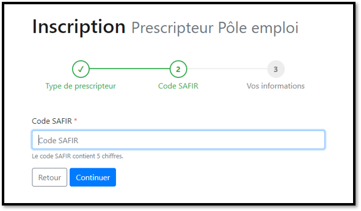

**Complétez le formulaire, en renseignant votre prénom, nom et adresse e-mail professionnelle**  \(seules les adresses pole-emploi.fr sont acceptées\), **choisissez un mot de passe** puis cliquez sur **"Inscription"**

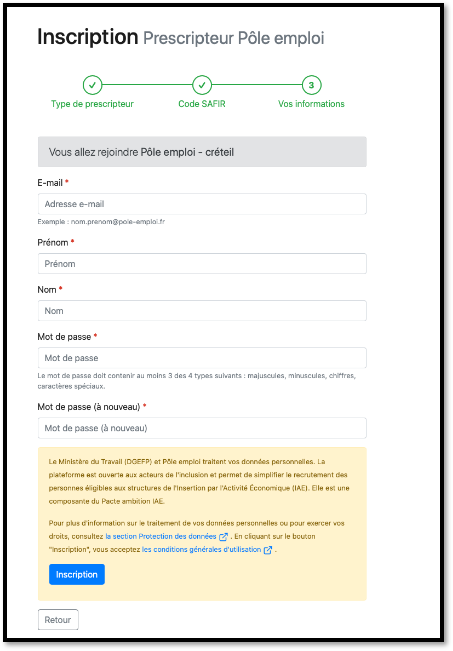


 **Vous recevez un mail contenant un lien de confirmation, cliquez sur ce lien pour activer votre compte.**


## Inscription pour un prescripteur habilité au national

A la question _"Travaillez-vous pour Pôle emploi ? "_, cliquez sur **"Non"** puis sur **"Continuer"**

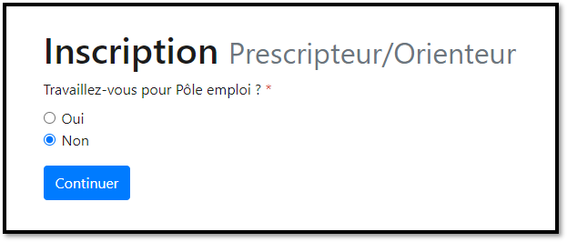

**Sélectionnez votre organisation** dans la liste, puis cliquez sur **"Continuer"**

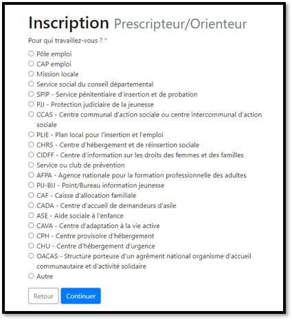

Renseignez le **numéro de SIRET** de votre organisation, puis cliquez sur "**Continuer"**

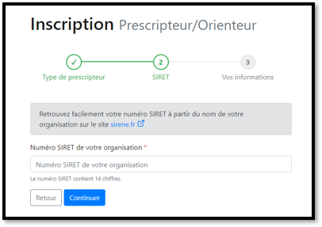

Complétez le formulaire en renseignant votre **adresse e-mail professionnelle, prénom et nom**. Choisissez votre mot de passe puis cliquez sur **"Inscription"**

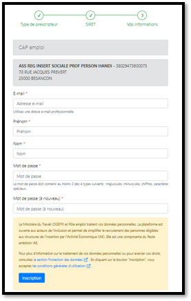


**Vous recevez un mail contenant un lien de confirmation, cliquez sur ce lien pour activer votre compte.**



Si un utilisateur est déjà membre de votre organisation vous ne pourrez rejoindre le compte de votre organisation que sur invitation. Contactez l'administrateur de l'organisation pour qu'il puisse vous inviter. [\[ Procédure d'invitation des collaborateurs \]](rattachement-collaborateur-au-compte.md)


## Inscription pour un prescripteur habilité au niveau préfectoral

A la question _"Travaillez-vous pour Pôle emploi ? "_, cliquez sur **"Non"** puis sur **"Continuer"**

**Sélectionnez "Autre"**, puis cliquez sur **"Continuer"**

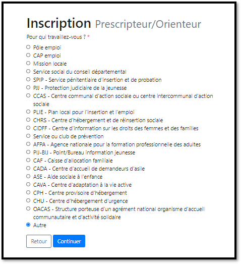

À la question **"**_Pour qui travaillez-vous ?"_, sélectionnez **"Pour une organisation habilitée par le Préfet,** puis cliquez sur **"Continuer"**

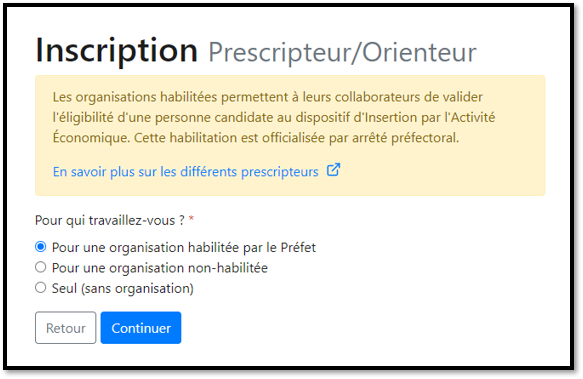

Confirmez votre habilitation préfectorale en cliquant sur **"Oui, je confirme que mon organisation est habilitée par le Préfet",** puis cliquez sur **"Continuer"**

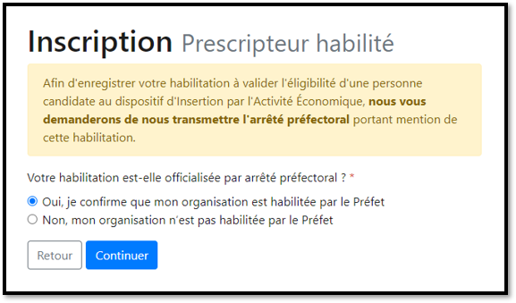

Renseignez le **numéro de SIRET** de votre organisation, puis cliquez sur "**Continuer"**

Complétez le formulaire en renseignant votre **adresse e-mail professionnelle, prénom et nom**. Choisissez votre mot de passe puis cliquez sur **"Inscription"**


**Vous recevez un mail contenant un lien de confirmation, cliquez sur ce lien pour activer votre compte.**



Si un utilisateur est déjà membre de votre organisation vous ne pourrez rejoindre le compte de votre organisation que sur invitation. Contactez l'administrateur de l'organisation pour qu'il puisse vous inviter. [\[ Procédure d'invitation des collaborateurs\]](rattachement-collaborateur-au-compte.md)


Un message d'information en jaune vous invite à nous **transmettre votre arrêté préfectoral** portant mention de votre habilitation en cliquant sur **"Cliquez ici pour l'envoyer"**

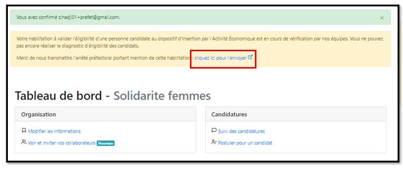


Vous serez notifié\(e\) par mail dès que votre demande d'habilitation aura été traitée par notre équipe.


## Inscription pour une organisation conventionnée par un Conseil Départemental **pour le suivi des \(Bénéficiaires du RSA\)**

A la question _"Travaillez-vous pour Pôle emploi ? "_, cliquez sur **"Non"** puis sur **"Continuer"**

**Sélectionnez "Service social du Conseil Départemental"**, puis cliquez sur **"Continuer"**

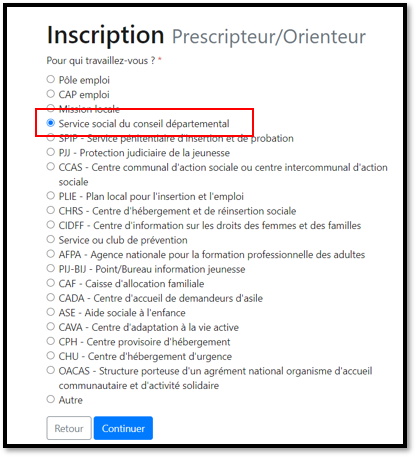

Renseignez le **numéro de SIRET** de votre organisation \(pas celui du Conseil Départemental\), puis cliquez sur "**Continuer"**

  
Complétez le formulaire en renseignant votre **adresse e-mail professionnelle, prénom et nom**. Choisissez votre mot de passe puis cliquez sur **"Inscription"**


**Vous recevez un mail contenant un lien de confirmation, cliquez sur ce lien pour activer votre compte.**



Si un utilisateur est déjà membre de votre organisation vous ne pourrez rejoindre le compte de votre organisation que sur invitation. Contactez l'administrateur de l'organisation pour qu'il puisse vous inviter. [\[ Procédure d'invitation des collaborateurs\]](rattachement-collaborateur-au-compte.md)



**Le statut de votre habilitation restera en attente le temps qu’un modérateur vérifie votre identité. Pendant ce laps de temps, vos prescriptions ne seront pas considérées comme celles d’un prescripteur habilité mais comme celles d’un orienteur.**


## Inscription pour un orienteur

A la question _"Travaillez-vous pour Pôle emploi ? "_, cliquez sur **"Non"** puis sur **"Continuer"**

Sélectionnez **"Autre"**, puis cliquez sur **"Continuer"**

A la question **"**_Pour qui travaillez-vous ?"_, **sélectionnez "Pour une organisation non-habilitée", puis cliquez sur "Continuer"**

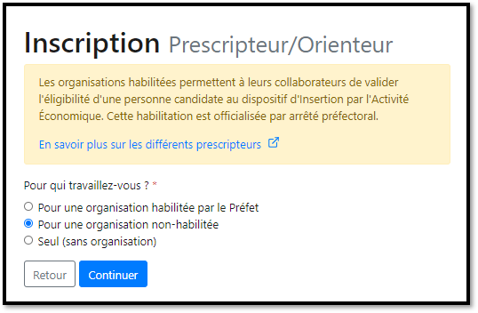


**Vous pouvez également faire le choix d'utiliser la plateforme sans vous rattacher à une organisation. Dans ce cas cliquez sur "Seul \(sans organisation\)".** [**\[Voir la suite du processus d'inscription pour un orienteur sans organisation\]**](inscription-prescripteur.md#inscription-pour-un-orienteur-sans-organisation)\*\*\*\*


Renseignez le **numéro de SIRET** de votre organisation, puis cliquez sur "**Continuer"**

Complétez le formulaire en renseignant votre **adresse e-mail professionnelle, prénom et nom**. Choisissez votre mot de passe puis cliquez sur **"Inscription"**


**Vous recevez un mail contenant un lien de confirmation, cliquez sur ce lien pour activer votre compte.**



Si un utilisateur est déjà membre de votre organisation vous ne pourrez rejoindre le compte de votre organisation que sur invitation. Contactez l'administrateur de l'organisation pour qu'il puisse vous inviter. [\[ Procédure d'invitation des collaborateurs\]](rattachement-collaborateur-au-compte.md)


## Inscription pour un orienteur sans organisation

  
A la question **"**_Pour qui travaillez-vous ?"_, **sélectionnez "Seul \(sans organisation\)",** puis cliquez sur **"Continuer"**

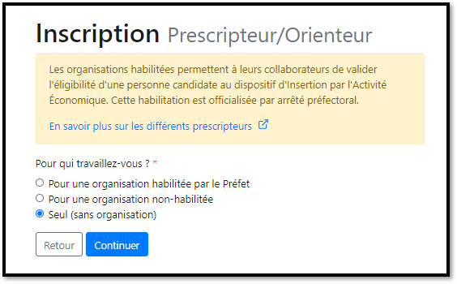

Complétez le formulaire en renseignant votre **adresse e-mail, prénom et nom**. Choisissez votre mot de passe puis cliquez sur **"Inscription"**

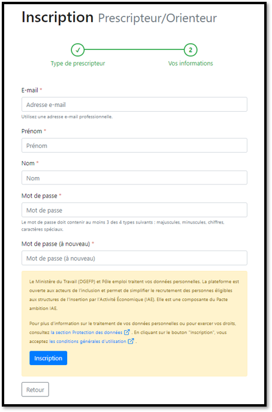


**Vous recevez un mail contenant un lien de confirmation, cliquez sur ce lien pour activer votre compte.**


