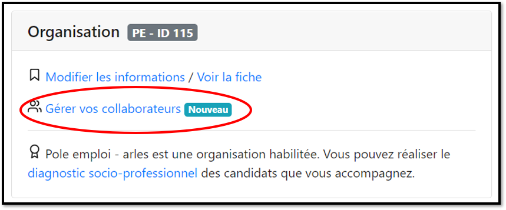
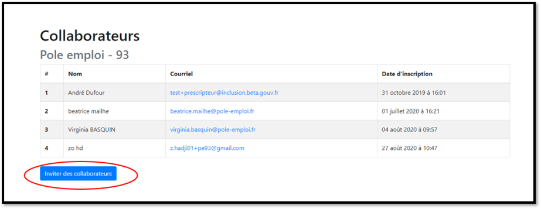

# Inviter mes collaborateurs à se rattacher au compte de l'organisation

Depuis votre tableau de bord, cliquez sur** "Gérer vos Collaborateurs"**

Puis cliquez sur** "Inviter des collaborateurs"**

Renseignez le nom, prénom et adresse mail de votre collaborateur, vous pouvez en inviter plusieurs en même temps en cliquant sur **"Ajouter un collaborateur"**. Puis cliquez sur **"Envoyer"**

.png>)


Le collaborateur invité reçoit un mail avec un lien d'accès pour rejoindre votre organisation. Ce lien reste valable 2 semaines.


