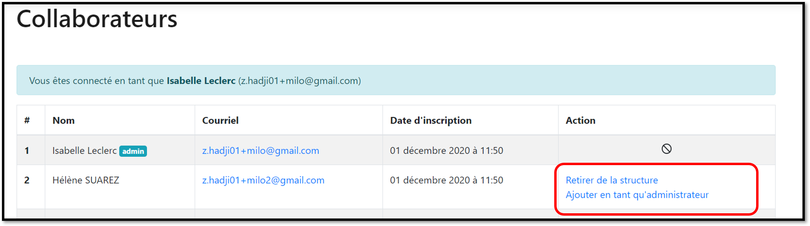

# Administrateur de la structure

**Le premier utilisateur qui créé le compte d'une structure devient Administrateur**. Ce statut n'est pas définitif, il peut être changé à tout moment

Le statut d'administrateur n'est pas uniquement réservé aux managers, chaque organisation définit qui peut être administrateur (exemple : le chargé de recrutement, le manager d'équipe, ou toute autre personne volontaire…)

Une **structure peut avoir plusieurs administrateurs.**

Un administrateur peut :&#x20;

* **Nommer d'autres administrateurs** en cliquant sur **\[Ajouter en tant qu'administrateur]**
* **Supprimer des membres **en cliquant sur** \[Retirer de la structure]**
* **Retirer les droits admin **d'un autre membre en cliquant sur **\[Retirer les droits d'administrateur]**

La fonction ["inviter des collaborateurs"](invitation-collaborateurs.md) est accessible à tous les membres de l'organisation


Bonne pratique : Si vous avez créé le compte de votre structure et que vous ne souhaitez pas être administrateur, vous pouvez inviter la personne qui prendra ce rôle et lui attribuer le statut d'administrateur. Le nouvel administrateur se chargera de vous retirer les droits admin.

