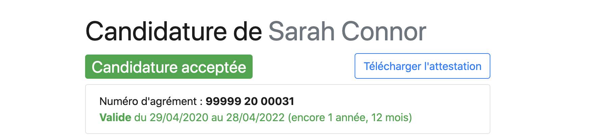

# Embaucher un candidat

1. Sur une candidature à l'étude, cliquez **Je l'embauche** pour saisir les détails du contrat
2. **Informez le candidat** directement via le** Message de réponse**
3. **Confirmez l'embauche** en cliquant de nouveau sur **Je l'embauche**
4. **Choisissez de demander **un Pass IAE ou non&#x20;
5. **La délivrance ou le refus d'un Pass IAE est immédiat **(Sauf si vous avez connaissance d'une inscription à Pôle emploi (actuelle ou passée) et que vous ne mentionnez pas son numéro d'inscription) :thumbsup:&#x20;


Pour les [**SIAE**](../pourquoi-une-plateforme-de-linclusion/qui-sont-les-employeurs-solidaires.md), le [**Pass IAE **](https://doc.inclusion.beta.gouv.fr/pourquoi-une-plateforme-de-linclusion/pass-iae-agrement-plus-simple-cest-a-dire)vous sera adressé par mail sous 2 jours en moyenne. Vous pouvez aussi téléchargez votre **Pass IAE** depuis votre **Tableau de bord **dans les 96 heures suivant la date de début du contrat. Il apparaît en lien avec la **candidature acceptée **et vous pouvez aussi le retrouver dans **Candidatures reçues. **


####

#### Exemple de Pass IAE

