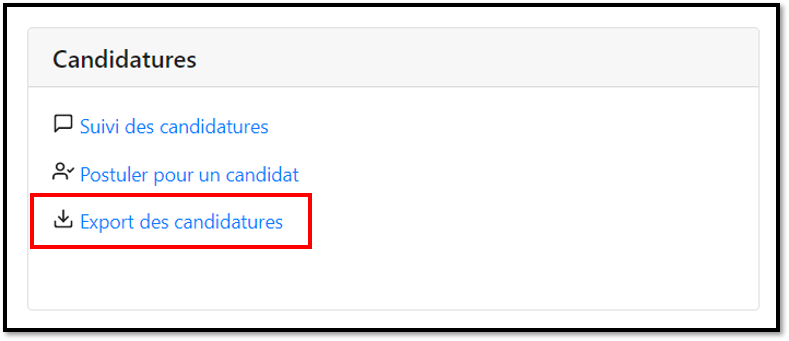

# Exporter mes candidatures sur Excel

Depuis votre tableau de bord, cliquez sur **"Export des candidatures"**

Pour chaque mois un fichier d'export est disponible, cliquez sur **"télécharger"**


Une fois le téléchargement terminé, n'ouvrez pas directement le fichier.


### **👉 Ouvrez une nouvelle page Excel**

Cliquez sur** "Données", **puis sur** "A partir d'un fichier texte/CSV"**

.png>)

Sélectionnez le fichier téléchargé puis cliquez sur **"Importer"**&#x20;

.png>)

Une fenêtre de paramétrage s'affiche :&#x20;

1- Dans  la partie **"Origine du fichier"  :** sélectionnez " **65001 : Unicode (UTF-8)**” (la référence se trouve en bas de la liste déroulante).&#x20;

2-  Puis cliquez sur **"Charger"**

.png>)


Pensez à bien enregistrer le tableau car les modifications apportées n'impacteront pas le fichier téléchargé.


### Voici un autre tutoriel si vous avez une autre version d'Excel  (Document créé par par C. REVELIN - Pôle emploi La Réunion )


Tuto Export des candidatures&#x20;

