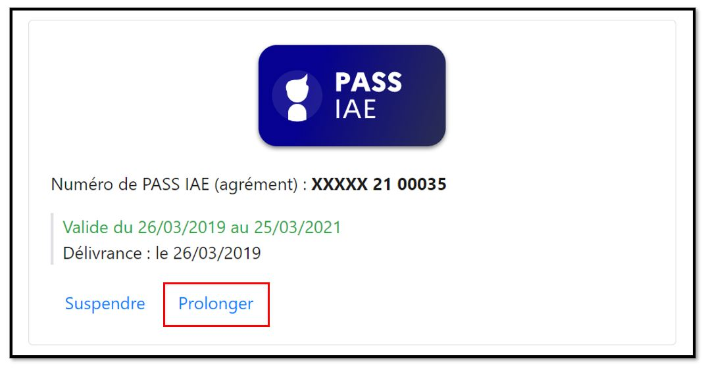

# Prolonger un agrément

Si la situation d'un salarié le nécessite, il est possible sous certaines conditions de prolonger un PASS IAE au-delà de 24 mois.

### 🟡Motifs de prolongation communs à toutes les SIAE :&#x20;

| 📃Motifs                                                 | ⏱Durées                                                                                                                                         |
| -------------------------------------------------------- | ----------------------------------------------------------------------------------------------------------------------------------------------- |
| **CDI conclu avec une personne âgée d'au moins 57 ans ** | 
12 mois de prolongation maximum. 

Renouvellements : jusqu'à la rupture du CDI à l'initiative de l'employeur ou à celle du salarié.
 |
| **Fin d'une formation**                                  | Jusqu'à la fin de l'action de formation                                                                                                         |
| **RQTH**                                                 | 
12 mois de prolongation maximum. 

Renouvellements : dans la limite de 5 ans.
                                                       |
| **50 ans et plus**                                       | 
12 mois de prolongation maximum.

Renouvellements : dans la limite de 7 ans.
                                                        |
| **Contexte sanitaire (motif temporaire)**                | 12 mois de prolongation maximum.                                                                                                                |

### 🟠Motif de prolongation supplémentaire pour les AI et ACI&#x20;

| 📃Motif                                                                               | ⏱Durée                                                                                                                                                                                                                                                         |
| ------------------------------------------------------------------------------------- | -------------------------------------------------------------------------------------------------------------------------------------------------------------------------------------------------------------------------------------------------------------- |
| **Difficultés particulières qui font  obstacle à l'insertion durable  dans l’emploi** | 
12 mois de prolongation maximum.                                                                                                                                                                      

Renouvellements : dans la limite de 5 ans.
 |


## Comment ça marche ?&#x20;

1️⃣** L'employeur sollicite un prescripteur habilité pour demander la prolongation**.&#x20;

Cette demande se fait en dehors du site (e-mail, courrier, téléphone) :&#x20;

* l'employeur dresse un bilan des actions réalisées (uniquement si le bénéficiaire du parcours IAE est actuellement dans l'effectif de la SIAE),
* &#x20;il présente le plan d'accompagnement envisagé ainsi que la durée nécessaire (dans la limite des durées indiquées ci-dessus).

2️⃣ **Le prescripteur habilité prend sa décision : **

* <mark style="color:green;">**S'il donne son accord**</mark> <mark style="color:green;">: l'employeur peut enregistrer l'autorisation de prolongation</mark> <mark style="color:blue;"></mark>[<mark style="color:blue;">\[voir mode d'emploi\]</mark>](prolonger-un-pass-iae.md#mode-demploi-pour-enregistrer-une-demande-de-prolongation-en-ligne)<mark style="color:blue;">.</mark>
* <mark style="color:red;">**S'il refuse :**</mark><mark style="color:red;"><mark style="color:green;">** **<mark style="color:green;"></mark><mark style="color:red;">il doit motiver le refus par écrit et notifier, par tout moyen la structure et le salarié ou candidat.</mark>

<mark style="color:red;"></mark>


## Mode d'emploi pour enregistrer une demande de prolongation en ligne :&#x20;


L'enregistrement de l'autorisation de prolongation est **possible dès le 3ème mois qui précède la fin d'un agrément et jusqu'au dernier jour de validité d'un agrément. **

Si l'agrément  est expiré il ne sera plus possible de demander une prolongation.


2 cas de figure :&#x20;

[1- L'agrément du salarié est déjà disponible dans votre tableau de bord (dans la rubrique candidatures acceptées)](prolonger-un-pass-iae.md#cas-1-lagrement-du-salarie-est-deja-disponible-dans-votre-tableau-de-bord-dans-la-rubrique-candidatures-acceptees)

[2- L'agrément du candidat/salarié n'est pas disponible dans votre tableau de bord](prolonger-un-pass-iae.md#cas-2-lagrement-du-candidat-salarie-nest-pas-disponible-dans-votre-tableau-de-bord)

### Cas 1 : L'agrément du salarié est déjà disponible dans votre tableau de bord (dans la rubrique candidatures acceptées)

Pour prolonger l'agrément, RDV sur la candidature concernée (elle est disponible dans la rubrique "candidatures acceptées"

Cliquez sur "Prolonger" et compléter le[ formulaire de prolongation](prolonger-un-pass-iae.md#formulaire-de-demande-prolongation)

.png>)

### Cas 2 : L'agrément du candidat/salarié n'est pas disponible dans votre tableau de bord

Depuis votre tableau de bord, dans le bloc "Mes candidatures", cliquez sur** "Prolonger/Suspendre un agrément"**

.png>)

Renseignez le numéro de l'agrément et cliquez sur **"Rechercher"**

.png>)

L'agrément est affiché, cliquez sur **"Oui, je souhaite prolonger ou suspendre l'agrément"**

.png>)

**Renseignez l'adresse e-mail personnel du bénéficiaire**, puis cliquez sur **"Continuer"**

.png>)

&#x20;Une nouvelle candidature est créée afin de gérer l'agrément

### Formulaire de prolongation :&#x20;

Depuis la page de détails de la candidature, cliquez sur **"Prolonger"**

Complétez le formulaire d'autorisation, puis cliquez sur **"Valider la déclaration"**

.png>)

Vérifiez les informations puis cliquez sur**  "Confirmer la déclaration"**

.png>)


Le conseiller Pôle emploi est notifié par mail et pourra accepter ou refuser la demande

