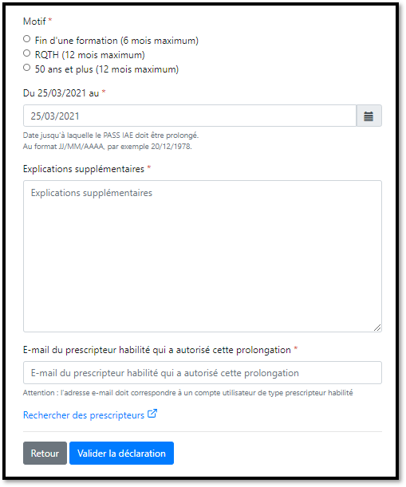
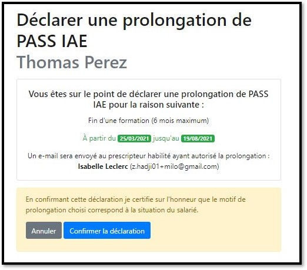

# Prolonger un PASS IAE

Si vous souhaitez prolonger un PASS IAE, **vous devez obtenir l'autorisation d'un prescripteur habilité inscrit sur les emplois de l'inclusion.**

Les prolongations sont autorisées 3 mois avant la fin d'un PASS IAE pour les motifs suivants : 

* Fin d'une formation \(6 mois de prolongation maximum\) 
* RQTH \(12 mois de prolongation maximum\) 
* 50 ans et plus \(12 mois de prolongation maximum\) 

Les AI et ACI ont un motif supplémentaire : 

* Difficultés particulières qui font obstacle à l'insertion durable dans l’emploi \(12 mois de prolongation maximum dans la limite de 5 ans\)

Pour enregistrer une prolongation, RDV sur la candidature concernée :

Cliquez sur **"Prolonger"**

Complétez le formulaire d'autorisation, puis cliquez sur **"Valider la déclaration"**

Vérifiez les informations puis **"Confirmer la déclaration"**


Le prescripteur habilité reçoit un mail d'information


La durée du PASS IAE est prolongée. Vous retrouvez le détail dans la page de candidature.

