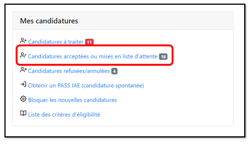

# Suspendre Un PASS IAE

La suspensions de PASS IAE se fait depuis la fiche candidature disponible dans la rubrique "candidatures acceptées"


L'employeur doit suspendre un PASS IAE pour les motifs suivants :

* ****[**Contrat de travail suspendu**](https://travail-emploi.gouv.fr/droit-du-travail/la-vie-du-contrat-de-travail/article/contrat-de-travail-les-principales-caracteristiques#Quelles-sont-les-situations-entrainant-la-suspension-du-contrat-de-travail-nbsp) **depuis plus de 15 jours**&#x20;
* **Contrat de travail rompu**&#x20;
* **Contrat de travail terminé**


### Comment faire ?&#x20;

Dans votre tableau de bord, cliquez sur **"Candidatures acceptées"**

Puis cliquez sur **"Gérer la candidature"**

.png>)

Ensuite sur **"Suspendre"**

.png>)

Renseignez la date de début et de fin (Rétroactivité possible 30 jours avant la date du jour)

.png>)

Sélectionnez le **motif** et cliquez sur **"Valider la suspension"**

.png>)

**Confirmez** la suspension

.png>)

La mention "PASS IAE suspendu" est affichée sur la fiche candidature

.png>)

Si besoin vous pouvez **"Modifier"** ou **"Annuler"** la suspension (possible uniquement si elle est encore en cours de validité, sinon [contactez-nous ](https://assistance.inclusion.beta.gouv.fr/accueil/support))

.png>)
