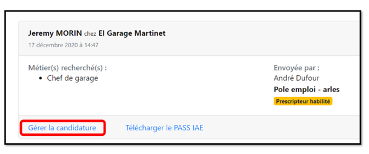
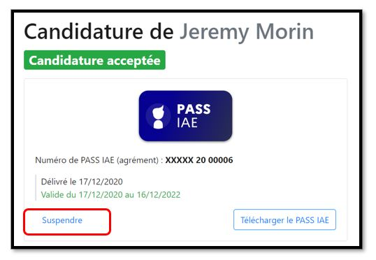
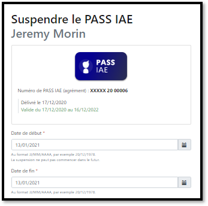
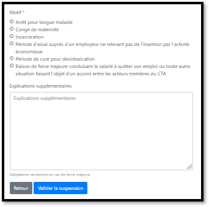
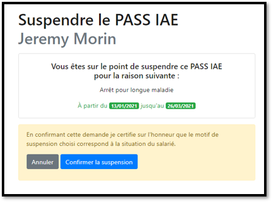
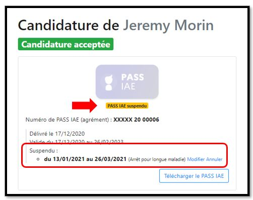
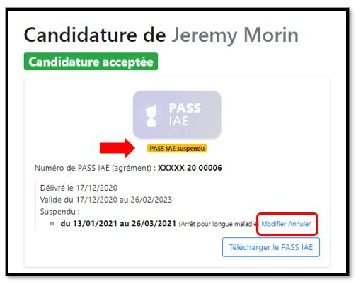

# Suspendre Un PASS IAE

Les suspensions de PASS IAE sont possibles depuis la fiche candidature disponible dans la rubrique "candidatures acceptées"

Si vous souhaitez en savoir plus sur les motifs de suspension vous pouvez consulter la [note dédiée aux suspensions](../pourquoi-une-plateforme-de-linclusion/pass-iae-agrement-plus-simple-cest-a-dire.md#suspension)

La suspension du PASS IAE est disponible dès le 5ème jour qui suit le démarrage du parcours IAE. 

### Comment faire ? 

Dans votre tableau de bord, cliquez sur **"Candidatures acceptées"**

Puis cliquez sur **"Gérer la candidature"**

Ensuite sur **"Suspendre"**

Renseignez la date de début et de fin \(la suspension peut être rétroactive et il vous sera également possible de modifier les dates en cas de besoin\)

_Attention s'il s'agit d'un agrément Pôle emploi récupéré via le module "prolonger/suspendre un agrément"  la rétroactivité n'est pas possible, en cas de besoin vous pouvez_ [_nous contacter_](https://assistance.inclusion.beta.gouv.fr/accueil/support)_._

Sélectionnez le **motif** et cliquez sur **"Valider la suspension"**

**Confirmez** la suspension

La mention "PASS IAE suspendu" est affichée sur la fiche candidature

Si besoin vous pouvez **"Modifier"** ou **"Annuler"** la suspension

