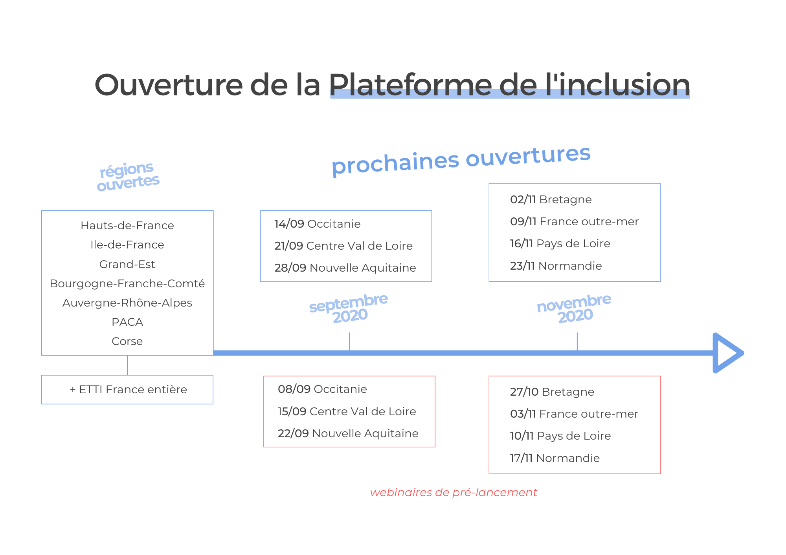

# Rendez-vous webinaires

Pour **accompagner le déploiement et faciliter la prise en main de la Plateforme** par tous les acteurs de l'inclusion, nous organisons des **Webinaires de présentation par thématique et/ou par région**. Retrouvez **tous les replay sur cette page**.

Vous retrouverez les [réponses aux questions posées pendant les webinaires ici](https://docs.google.com/spreadsheets/d/1piM7ZiGsAYUPRJ_P2iAoIx7LpYhdqChnotUvTo5LxUg/edit#gid=151808733)

 **Nos webinaires sont organisés à la demande des acteurs sur chaque territoire, mais ils sont ouverts à tous. N'hésitez pas à vous inscrire.**

**Voici le calendrier d'ouverture de la Plateforme de l'inclusion, ainsi que les dates des webinaires de pré-lancement organisés pour chaque région**  👇


 **Pour vous inscrire aux prochains rendez-vous, cliquez sur le thème qui vous intéresse !** 👇


## Vous souhaitez assister à une démonstration détaillée de la Plateforme ? Inscrivez-vous à nos webinaires de démonstration : 


**💻 Open Webinaires de démonstration :**

**Pour les prescripteurs :** 

* \*\*\*\*[**05 Novembre à 15h30 \[UTC +1\]** : Démonstration pour les prescripteurs habilités](https://app.livestorm.co/itou/open-webinaire-de-demonstration-pour-les-prescripteurs)
* \*\*\*\*[**26 Novembre  à 10h00 \[UTC +1\]** : Démonstration pour les prescripteurs habilités](https://app.livestorm.co/itou/webinaire-demo-pour-les-prescripteurs)

**Pour les employeurs solidaires \(SIAE, GEIQ, EA ...\) :** 

* [**Jeudi 19 Novembre à 10h00** : Webinaire de formation pour les SIAE](https://app.livestorm.co/itou/demonstration-de-la-plateforme-de-linclusion-a-destination-des-siae)
* [**Mardi 1er Décembre à 10h00** : Webinaire de formation pour les SIAE ](https://app.livestorm.co/itou/demonstration-de-la-plateforme-de-linclusion-dediee-aux-siae)
* [**Mardi 15 Décembre à 10h00** : Webinaire de formation pour les SIAE](https://app.livestorm.co/itou/demonstration-de-la-plateforme-de-linclusion-pour-les-siae)


## La Plateforme bientôt dans votre région ! Inscrivez-vous à nos webinaires de pré-lancement :  


**🚀 Webinaires de lancement officiel Novembre 2020 :**

* [27 Octobre 14h : pré-lancement officiel en **Bretagne**](https://app.livestorm.co/itou/pre-lancement-officiel-de-la-plateforme-de-linclusion-en-bretagne) ****
* [03 Novembre 15h \[UTC +1\] : pré-lancement officiel **Outre mer**](https://app.livestorm.co/itou/pre-lancement-officiel-de-la-plateforme-de-linclusion-en-france-outre-mer) 
* [10 Novembre 14h : pré-lancement officiel **Pays de Loire**](%20https://app.livestorm.co/itou/pre-lancement-officiel-de-la-plateforme-de-linclusion-en-pays-de-loire) ****
* [17 Novembre 14h : pré-lancement officiel **Normandie**](https://app.livestorm.co/itou/pre-lancement-officiel-de-la-plateforme-de-linclusion-en-normandie)\*\*\*\*



 Vous souhaitez **organiser un webinaire de déploiement ou de présentation** sur votre territoire ou au sein de votre réseau ? 👉\*\*\*\*[**Accéder au formulaire**](https://startupsbeta.typeform.com/to/btgqYsdQ) ! 😊 


## **Retrouvez les webinaires précédents :**

### 👉02.10**.20** Open webinaire de démonstration pour les prescripteurs



📕 Voir le support de présentation

### 👉29**.09.20** Présentation de l'IAE & de la Plateforme de l'inclusion - DIRECCTE & Pôle emploi - AURA



### 👉23**.09.20** Pôle emploi & la Plateforme de l'inclusion- régions : Bretagne - Normandie - PDL - Outre Mer

📕[Voir le support de présentation](https://drive.google.com/file/d/13HLouIwbnQnCi83oJ-r5WKzZEfz2brOd/view?usp=sharing)



\*\*\*\*

### 👉22**.09.20 Webinaire de Lancement officiel en Nouvelle Aquitaine**

📕[Voir le support de présentation](https://drive.google.com/file/d/13HLouIwbnQnCi83oJ-r5WKzZEfz2brOd/view?usp=sharing)



###  ****👉22**.09.20 Webinaire de Lancement officiel en Centre-Val de Loire**

📕[Voir le support de présentation](https://drive.google.com/file/d/13HLouIwbnQnCi83oJ-r5WKzZEfz2brOd/view?usp=sharing)



### 👉 **08.09.20 Webinaire de pré-lancement officiel en Occitanie**

Le support de présentation est [disponible ici](https://drive.google.com/file/d/1KsO1OYdDuUx7xhBxWMxgbXGy3xDK8nd5/view)



### 👉 07/09/20 Webinaire 1er RDV des Régionales de l'inclusion



### 👉 22.07.20 Webinaire de démonstration spécial prescripteurs

Le Support de présentation est  [disponible ici](https://drive.google.com/file/d/1VyxQap0fF2LLJTKoxCoS5ZRBzu3e-7Mv/view)



### 👉 **10**.07.20 - Webinaire de démonstration pour les prescripteurs du 93

Copiez le lien pour partager ce replay : [https://youtu.be/WdDYeq2AMwE](https://youtu.be/WdDYeq2AMwE)



### 👉 **10**.07.20 - Webinaire pré-lancement en Bretagne

Copiez le lien pour partager ce replay : [https://youtu.be/BrE46IdIYno](https://youtu.be/BrE46IdIYno)



### 👉 09.07.20 - Webinaire spécial Réseau des Cap emploi

Copiez le lien pour partager ce replay : [https://youtu.be/Bwh4JzcGHsM](https://youtu.be/Bwh4JzcGHsM)





### 👉 **02.07.20 - Lancement de l’expérimentation de la Place de marché de l’inclusion** 

Copiez le lien pour partager ce replay : [https://youtu.be/\_tnJKEdjvtI](https://youtu.be/_tnJKEdjvtI)





\*\*\*\*

\*\*\*\*

\*\*\*\*👉 **30.06.20 - Lancement officiel de la Plateforme de l'inclusion : Corse & PACA**

Copiez le lien pour partager ce replay **:** [https://youtu.be/gHD-5591sZo](https://youtu.be/gHD-5591sZo)



\*\*\*\*

\*\*\*\*

\*\*\*\*👉 **23.06.20 - Déploiement de la Plateforme de l'inclusion : Les GEIQ**

Copiez le lien pour partager ce replay : [https://youtu.be/Ug8wwNMyeJI](https://youtu.be/Ug8wwNMyeJI)



\*\*\*\*👉 **23.06.20 - Lancement de la Plateforme en Auvergne-Rhône-Alpes**

Copiez le lien pour partager ce replay : ****[https://youtu.be/fewlcGpptFM](https://youtu.be/fewlcGpptFM)



#### \*\*\*\*

#### \*\*\*\*👉 **15**.06.2020 - Lancement **de la Plateforme** en Bourgogne-Franche-Comté **\(organisé par la DIRECCTE, Pôle emploi et l'équipe Itou\)**

Copiez le lien pour partager ce replay : [https://youtu.be/XsCgXheBlQo](https://youtu.be/XsCgXheBlQo)



\*\*\*\*

\*\*\*\*👉 **04.06.2020 - Déploiement réseau CNLRQ**

Copiez le lien pour partager ce replay : [https://youtu.be/myRPITGZY00](https://youtu.be/myRPITGZY00)



#### 👉 19.05.2020 - Déploiement réseau COORACE

Copiez le lien pour partager ce replay : [https://youtu.be/vewGTKIgJ-s](https://youtu.be/vewGTKIgJ-s)



\*\*\*\*

#### 👉 21.04.2020 - Déploiement région Hauts-de-France

Copiez le lien pour partager ce replay : [https://youtu.be/YiKqvg7zgc8](https://youtu.be/YiKqvg7zgc8) 



#### 

#### 👉 14.04.2020 - Déploiement région Grand Est 

Copiez le lien pour partager ce replay : [**https://youtu.be/wiFkInM-L3c**](https://youtu.be/wiFkInM-L3c)\*\*\*\*



#### 

#### 👉 07.04.2020 - Déploiement région Ile-de-France

Copiez le lien pour partager ce replay : [https://youtu.be/hK7R4PaQm\_w](https://youtu.be/hK7R4PaQm_w)



👉 **01.04.2020 - Accompagnement Prise en main de la Plateforme : ETTI France entière**

Copiez le lien pour partager ce replay : [https://youtu.be/XmKB4DZ2EBM](https://youtu.be/XmKB4DZ2EBM)



#### 

#### 👉 31.03.2020 - **Déploiement de la Plateforme :** ETTI France entière

Copiez le lien pour partager ce replay : [https://youtu.be/SL3tHl8Bl-s](https://youtu.be/SL3tHl8Bl-s)



#### 

#### 👉 24.03.2020 - **Déploiement de la Plateforme :** Fédération des entreprises d'insertion

Copiez le lien pour partager ce replay : [https://youtu.be/iJmNF1NgL\_Q](https://youtu.be/iJmNF1NgL_Q)



#### 👉 16.03.2020 - Webinaire national : comprendre le déploiement de la Plateforme

Copiez le lien pour partager ce replay : [https://youtu.be/iJmNF1NgL\_Q](https://youtu.be/iJmNF1NgL_Q)



