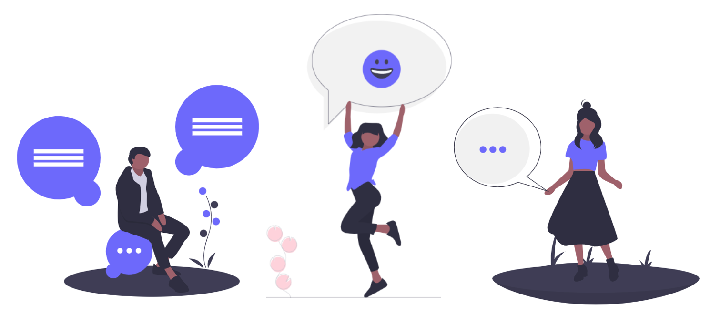

# Une co-construction avec les acteurs de l'IAE

Le service des [emplois de l'inclusion](https://emplois.inclusion.beta.gouv.fr) **** place **les utilisateurs au cœur de sa transformation**.&#x20;

Le site évolue en **mode co-construction avec les acteurs de l’IAE** afin d'apporter des réponses **au plus proche du terrain**.

Cette **innovation collaborative (OpenLab)**, basée sur l’expérience terrain, permet de :

* Faire **émerger les bonnes idées** ainsi que les **services et outils futurs**
* Garantir **cohérence, pertinence, opérationnalité** des évolutions mises en œuvre

### **Les OpenLab sont ouverts à tous !**&#x20;

Pour participer et être tenu informé de l’actualité des emplois de l'inclusion :point\_right: **** [**Merci de remplir le formulaire**](https://docs.google.com/forms/d/e/1FAIpQLSebmbvb4RGJOKy-ou5zR2eHWwFOiUlSJtCv\_avrpp97HI4RGQ/viewform?ts=5da5a580)****

