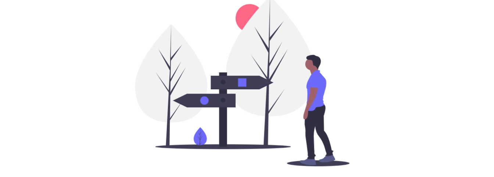
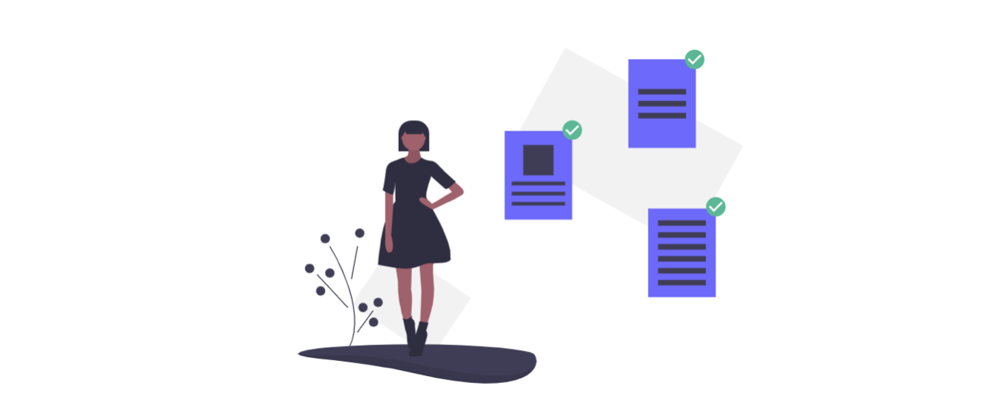

# Pass IAE : un agrément plus simple, c'est-à-dire?

* **Suppression de l’agrément délivré par Pôle** **emploi** avant toute embauche IAE
* En remplacement, **évaluation et validation de l'éligibilité à l’IAE via la Plateforme \(**[**critères d'éligibilité**](../qui-est-eligible-iae-criteres-eligibilite.md#criteres-administratifs-de-niveau-1)**\)** selon 2 voies  : 

  * Par les [**prescripteurs habilités**](qui-sont-les-differents-prescripteurs/prescripteur-habilite.md)\*\*\*\*
  * Directement par les [**SIAE** ](pass-iae-agrement-plus-simple-cest-a-dire.md#recrutement-direct-par-une-siae)\*\*\*\*

 **Envoi de candidatures réalisables par** [**tous les prescripteurs**](qui-sont-les-differents-prescripteurs/) **sans exception** \(SPE, organismes habilités en national ou par le Préfet, orienteurs avec ou sans organisation\), et **en** **auto-prescription par les** [**SIAE**](qui-sont-les-employeurs-solidaires.md) \(candidatures spontanées\). Toutefois, si le **candidat est adressé par un orienteur**, son **éligibilité** **sera validée par la SIAE**.

 **Pass IAE délivré par la Plateforme sous ≈ 2 jours ouvrés** pour toute demande d'embauche, dès lors que **le candidat remplit** [**1 critère de niveau 1 ou 3 critères de niveau 2**](../qui-est-eligible-iae-criteres-eligibilite.md#criteres-administratifs-de-niveau-1). **Éligibilité du candidat garantie 6 mois**. 

\*\*\*\* **Numéro de Pass IAE qui remplace l'agrément Pôle emploi**. À la même valeur. Est valide, dès sa réception par mail, pour l'**Extranet IAE 2.0 de l'ASP**.

 Nouveau système d'agrément **rattaché à une personne et non plus à un parcours**. Le **numéro de Pass IAE reste le même tout au long du parcours du candidat \(24 mois\)**, même si celui-ci change de SIAE. 

 Un [**candidat**](../qui-est-eligible-iae-criteres-eligibilite.md) peut bénéficier de **plusieurs parcours IAE d'une durée de 24 mois chacun**, à condition de respecter un **délai de carence de 2 ans** entre les parcours.

 Seul le ****[**prescripteur habilité**](qui-sont-les-differents-prescripteurs/prescripteur-habilite.md) peut prescrire un **parcours qui déroge à l'obligation de carence de 2 ans ou à celle des** [**critères d'éligibilité**](../qui-est-eligible-iae-criteres-eligibilite.md#criteres-administratifs-de-niveau-1). Un orienteur qui accompagne un candidat dans cette situation peut l'adresser au prescripteur habilité.


**Objectif du Pass IAE** : 

**Accélérer la délivrance de l'agrément** pour le candidat et **fluidifier son parcours**, tout **en allégeant les contraintes administratives** des professionnels pour leur permettre de **se consacrer pleinement à leur mission**.


###                                     **Le Pass IAE versus l'agrément Pôle emploi**

### \*\*\*\*

### **Prescription par un prescripteur habilité**

* Pôle emploi, mission locales, CAP emploi
* Des acteurs tels que le Conseil départemental, le SPIP, la PJJ…
* D’autres organismes validés par le Préfet \(CCAS, CAF, Centres d'hébergements, associations caritatives, CADA, services de l'ASE, Plie, EBE…**\)**
* Après avoir effectué un diagnostic socio-professionnel individualisé

 Pour ces prescripteurs habilités, **la prescription vaut contrôle d'éligibilité** à l'IAE

### R**ecrutement direct par une SIAE**

* Candidat sous critères d’éligibilité \(allocataire RSA, ASS, AAH, TH, senior, sous autorité de justice, QPV, DETLD, en sortie de l'ASE, niveau d’étude 3 et infra, DELD de + 12 mois, etc.\)
* Après avoir effectué un diagnostic socio-professionnel individualisé

 Pour toute SIAE, le **contrôle d’éligibilité se fait a posteriori \(Direccte\)**

\*\*\*\*


Cette **refonte de l’agrément** a été mise en œuvre sur **3 régions d’expérimentation** \(Ile-de-France, Haut-de-France, Grand Est\) avant de se **généraliser progressivement  d'ici fin 2020.**



👉\*\*\*\*[ **Retrouvez tout le détail de la refonte de l'agrément**](https://synesi.fr/wp-content/uploads/2019/09/20190910-Pacte_d_ambition_iae_sept_2019_Mesure-29.pdf)


## Vérification des demandes de PASS IAE

Une demande de Pass IAE sur la Plateforme de l’inclusion implique de **vérifier l’existence d’un agrément Pôle emploi en cours de validité ou avec une date d’échéance inférieure à 2 ans \(délai de carence légal\).**

**Si l'identifiant Pôle emploi est renseigné ou que le candidat n’est pas chez Pôle emploi, la vérification s’opère automatiquement.**

En revanche, **un candidat inscrit chez Pôle emploi qui ne renseigne pas son identifiant doit obligatoirement entraîner une vérification manuelle.** 

### **La vérification permet de contrôler quoi ?**

* L’existence d’un agrément en cours de validité  Si c’est le cas, l’employeur recevra un Pass IAE qui reprend le numéro et la durée restante de validité de l’agrément.   
* Qu’aucun agrément Pôle emploi n’a  été délivré durant les 2 années de carence   L’employeur recevra alors un Pass IAE d’une durée de validité de 2 ans.

### Que se passe-t-il quand le délai de carence n’est pas respecté ?

* La candidature a été transmise par un [prescripteur habilité](https://app.gitbook.com/@itou/s/doc-inclusion-beta-gouv-fr/pourquoi-une-plateforme-de-linclusion/qui-sont-les-differents-prescripteurs/prescripteur-habilite) ?   Le Pass IAE est accordé \(seul un prescripteur habilité peut déroger au délai de carence de 2 ans\).
* La candidature a été transmise par un autre acteur ?  Le Pass IAE est refusé.

Dans ce dernier cas, l’employeur peut se rapprocher d’un prescripteur habilité et exposer la situation de son candidat. Si le [prescripteur habilité](https://app.gitbook.com/@itou/s/doc-inclusion-beta-gouv-fr/pourquoi-une-plateforme-de-linclusion/qui-sont-les-differents-prescripteurs/prescripteur-habilite) est favorable à une dérogation du délai de carence pour le candidat, il transmettra la candidature à l’employeur via la Plateforme et déclenchera la délivrance du Pass IAE.  


**Pour trouver les** [**prescripteurs habilités**](https://app.gitbook.com/@itou/s/doc-inclusion-beta-gouv-fr/pourquoi-une-plateforme-de-linclusion/qui-sont-les-differents-prescripteurs/prescripteur-habilite) **proches de vous, pensez à utiliser le moteur de recherche depuis votre tableau de bord !**


## **Extension, Suspension, Prolongation : Quels changements avec le PASS IAE ?**

### Extension : 


**L’extension d’agrément n’existe plus.**

Le **PASS IAE délivré pour une durée de 2 ans est valable dans toutes les SIAE** quelque soit le type de structure.  


### Suspension : 


Pour toute demande de suspension l’employeur doit nous [contacter par mail ](mailto:assistance@inclusion.beta.gouv.fr)et nous indiquer:

* la référence du pass iae
* le nom prénom du candidat
* la date d’arrêt
* le motif de suspension

**Les motifs de suspension légitimes\* sont :**

* **Arrêt pour longue maladie**
* **Congé de maternité**
* **Incarcération**
* **Période d’essai auprès d’un employeur ne relevant pas de l’insertion par l’activité économique**
* **Période de cure pour désintoxication**
* **Raison de force majeure conduisant le salarié à quitter son emploi**
* **et toute autre situation faisant l’objet d’un accord entre les acteurs membres du CTA**

Un abandon de poste ou une fin de contrat de travail ne peut donner lieu à une suspension. Il est de la responsabilité partagée des structures employeuses et les prescripteurs, en fonction de leurs compétences propres, d’assurer la continuité du parcours en proposant des solutions permettant le maintien dans l’emploi du bénéficiaire, des actions de formation professionnelle ou toute action favorisant l’insertion professionnelle durable.  

Pour les ETTI, les périodes d’intermission ne sont pas décomptées comme périodes non travaillées justifiant la neutralisation du PASS IAE/ Agrément sauf lorsqu’elles entrent dans les catégories énumérées ci-dessus.  

_\*Circulaire DGEFP/DGAS n°2003-24 du 3 octobre 2003 relative à l’aménagement de la procédure d’agrément par l’ANPE et au suivi des personnes embauchées dans une structure d’insertion par l’activité économique._ 


### Prolongation :


Pour le moment, seuls les agréments Pôle emploi sont concernés par les cas de prolongation. Pour toute demande de prolongation d'agrément, l’employeur doit contacter  Pôle emploi.



**Procédure de demande de prolongation pour les PASS IAE \(applicable dès Novembre 2021\) :**  L’employeur pourra solliciter le prescripteur habilité de son choix pour demander une prolongation de PASS IAE.  


### Dérogation


Seuls les [**prescripteurs habilités** ](https://app.gitbook.com/@itou/s/doc-inclusion-beta-gouv-fr/pourquoi-une-plateforme-de-linclusion/qui-sont-les-differents-prescripteurs/prescripteur-habilite)peuvent déroger au délai de carence exigé entre 2 pass iae/agréments  \(= 2 ans\).

Pour ce faire, le prescripteur doit utiliser la Plateforme pour envoyer la candidature à l'employeur.



**Pour trouver les** [**prescripteurs habilités**](https://app.gitbook.com/@itou/s/doc-inclusion-beta-gouv-fr/pourquoi-une-plateforme-de-linclusion/qui-sont-les-differents-prescripteurs/prescripteur-habilite) **proches de vous, pensez à utiliser le moteur de recherche depuis votre tableau de bord !**


