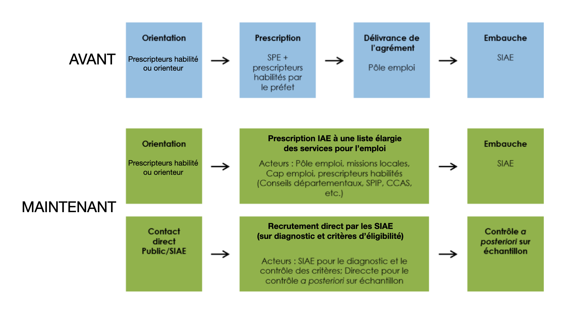

# Pass IAE : un agrément plus simple

## **Qu'est ce qui change  ?**

* **Suppression de la délivrance de l'agrément par Pôle** **emploi** avant toute embauche IAE
* En remplacement, **évaluation et validation de l'éligibilité à l’IAE via **[**les emplois de l'inclusion **](https://emplois.inclusion.beta.gouv.fr)**(**[**critères d'éligibilité**](../qui-est-eligible-iae-criteres-eligibilite/#criteres-administratifs-de-niveau-1)**) **selon 2 voies  :&#x20;
  * Par les [**prescripteurs habilités**](qui-sont-les-differents-prescripteurs/prescripteur-habilite.md)****
  * Directement par les [**SIAE **](pass-iae-agrement-plus-simple-cest-a-dire.md#recrutement-direct-par-une-siae)****
* **Délivrance d'un **[**PASS IAE**](../qui-est-eligible-iae-criteres-eligibilite/pass-iae-comment-ca-marche.md)** déclenché par la SIAE** lors de la confirmation d'embauche sur le site


[pass-iae-comment-ca-marche.md](../qui-est-eligible-iae-criteres-eligibilite/pass-iae-comment-ca-marche.md)


### **                                    Le Pass IAE versus l'agrément Pôle emploi**


:point\_right:****[** Retrouvez tout le détail de la refonte de l'agrément**](https://synesi.fr/wp-content/uploads/2019/09/20190910-Pacte\_d\_ambition\_iae\_sept\_2019\_Mesure-29.pdf)


## Vérification des demandes de PASS IAE

Une demande de Pass IAE sur la Plateforme de l’inclusion implique de **vérifier l’existence d’un agrément Pôle emploi en cours de validité ou avec une date d’échéance inférieure à 2 ans (délai de carence légal).**

**Si l'identifiant Pôle emploi est renseigné ou que le candidat n’est pas chez Pôle emploi, la vérification s’opère automatiquement.**

En revanche, **un candidat inscrit chez Pôle emploi qui ne renseigne pas son identifiant doit obligatoirement entraîner une vérification manuelle.**&#x20;

### **La vérification permet de contrôler quoi ?**

* L’existence d’un agrément en cours de validité  Si c’est le cas, l’employeur recevra un Pass IAE qui reprend le numéro et la durée restante de validité de l’agrément.  &#x20;
* Qu’aucun agrément Pôle emploi n’a  été délivré durant les 2 années de carence   L’employeur recevra alors un Pass IAE d’une durée de validité de 2 ans.

### Que se passe-t-il quand le délai de carence n’est pas respecté ?

* La candidature a été transmise par un [prescripteur habilité](qui-sont-les-differents-prescripteurs/prescripteur-habilite.md#liste-des-prescripteurs-habilites-au-national) ?   Le Pass IAE est accordé (seul un prescripteur habilité peut déroger au délai de carence de 2 ans).
* La candidature a été transmise par un autre acteur ?  Le Pass IAE est refusé.

Dans ce dernier cas, l’employeur peut se rapprocher d’un prescripteur habilité et exposer la situation de son candidat. Si le [prescripteur habilité ](qui-sont-les-differents-prescripteurs/prescripteur-habilite.md#liste-des-prescripteurs-habilites-au-national)est favorable à une dérogation du délai de carence pour le candidat, il transmettra la candidature à l’employeur via la Plateforme et déclenchera la délivrance du Pass IAE.\


**Pour trouver les **[**prescripteurs habilités**](qui-sont-les-differents-prescripteurs/prescripteur-habilite.md#liste-des-prescripteurs-habilites-au-national)** proches de vous, pensez à utiliser le moteur de recherche depuis votre tableau de bord !**


## **Extension, Suspension, Prolongation, Dérogation, Interruption : Quels changements avec le PASS IAE ?**

### Extension :&#x20;


**L’extension d’agrément n’existe plus.**

Le **PASS IAE délivré pour une durée de 2 ans est valable dans toutes les SIAE** quelque soit le type de structure.

Les structures suivantes peuvent récupérer le PASS IAE ou agrément  en cliquant sur[ "obtenir un PASS IAE"](../mon-monde-demploi-employeur-solidaire/valider-une-candidature-spontanee.md), il est impératif de renseigner l'identifiant Pôle emploi pour que la détection de l'agrément se fasse automatiquement.\



### Suspension :&#x20;


L'employeur peut suspendre un PASS IAE depuis son tableau de bord[ \[ Voir mode d'emploi - Suspendre un PASS IAE \] ](../mon-monde-demploi-employeur-solidaire/suspendre-un-pass-iae.md) pour les motifs suivants :

* [Contrat de travail suspendu](https://travail-emploi.gouv.fr/droit-du-travail/la-vie-du-contrat-de-travail/article/contrat-de-travail-les-principales-caracteristiques#Quelles-sont-les-situations-entrainant-la-suspension-du-contrat-de-travail-nbsp) depuis plus de 15 jours&#x20;
* Contrat de travail rompu&#x20;
* Contrat de travail terminé

Source : [Décret n° 2021-1128 du 30 août 2021 relatif à l'insertion par l'activité économique](https://www.legifrance.gouv.fr/jorf/id/JORFTEXT000043990367)


### Prolongation :


Pour le moment, seuls les agréments qui ont été initialement délivrés par Pôle emploi sont concernés par les demandes de prolongation

La prolongation est autorisée pour les motifs suivants :&#x20;

* CDI conclu avec une personne âgée d'au moins 57 ans ( 12 mois de prolongation maximum)
* Fin d'une formation (6 mois de prolongation maximum)&#x20;
* RQTH (12 mois de prolongation maximum)&#x20;
* 50 ans et plus (12 mois de prolongation maximum)&#x20;
* Contexte sanitaire (12 mois de prolongation maximum)&#x20;

Les ACI et AI ont un motif supplémentaire :&#x20;

* Difficultés particulières qui font obstacle à l'insertion durable dans l’emploi (12 mois de prolongation maximum, dans la limite de 5 ans)



L'enregistrement d'une prolongation est possible dès le 3ème mois qui précède la fin d'un PASS IAE et jusqu'au dernier jour de validité du PASS IAE. [\[Voir mode d'emploi\].](../mon-monde-demploi-employeur-solidaire/prolonger-un-pass-iae.md)


### Dérogation au délai de carence


Seuls les[ **prescripteurs habilités **](qui-sont-les-differents-prescripteurs/prescripteur-habilite.md#liste-des-prescripteurs-habilites-au-national)peuvent déroger au délai de carence exigé entre 2 Pass IAE/Agréments  (= 2 ans).

Pour ce faire, le prescripteur habilité doit utiliser la Plateforme pour envoyer la candidature à l'employeur.


### Dérogation aux critères administratifs exigés pour entrer en parcours IAE


Les [**prescripteurs habilités **](qui-sont-les-differents-prescripteurs/prescripteur-habilite.md#liste-des-prescripteurs-habilites-au-national)sont les seuls autorisés à prescrire un parcours IAE à un candidat qui ne remplit pas les critères d'éligibilité.&#x20;

Pour ce faire, le prescripteur habilité doit utiliser la Plateforme pour envoyer la candidature à l'employeur.



**Pour trouver les **[**prescripteurs habilités **](qui-sont-les-differents-prescripteurs/prescripteur-habilite.md#liste-des-prescripteurs-habilites-au-national)**proches de vous, pensez à utiliser le moteur de recherche depuis votre tableau de bord !**


### Interruption


L'interruption d'agrément n'existe pas avec le PASS IAE

L’interruption d’agrément qui existait chez Pole emploi ne permettait pas de conserver la durée de l’agrément c’était simplement le moyen pour Pole emploi de reprendre le suivi du bénéficiaire mais la durée était bien consommée. Seule la [suspension](pass-iae-agrement-plus-simple-cest-a-dire.md#suspension) permet de conserver la durée du PASS IAE.

S’il n’est ni suspendu ni annulé, le PASS IAE reste actif.

A noter qu’une annulation du PASS IAE entraine la suppression de l’aide au poste pour les jours éventuellement travaillés.


