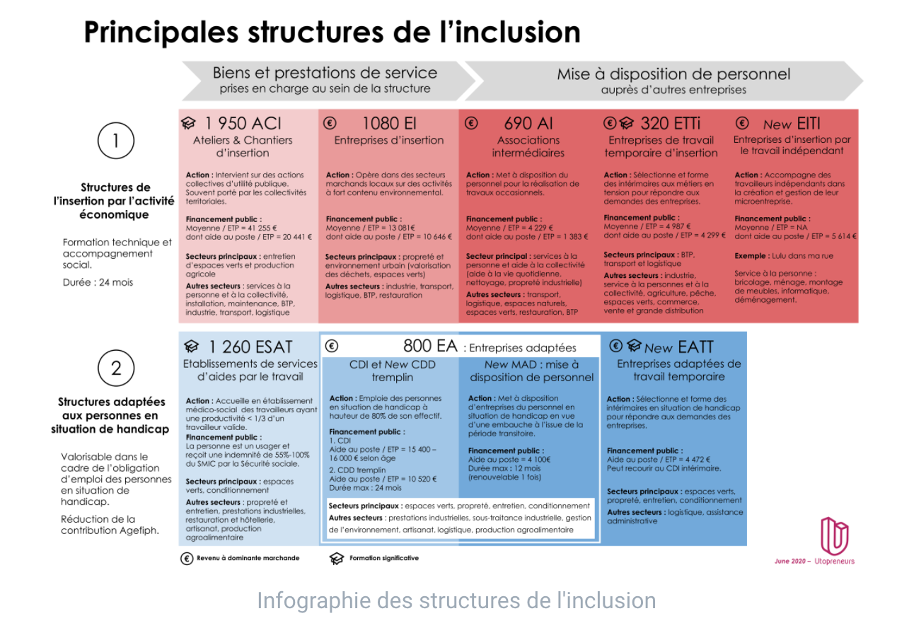

# Les employeurs solidaires

Un **employeur solidaire** est soumis aux mêmes règles que tout employeur, il **se distingue simplement par sa finalité** : l**’insertion professionnelle de** [**personnes en difficultés**](../qui-est-eligible-iae-criteres-eligibilite/) afin de les accompagner vers **un retour à l'emploi durable**.

Les **employeurs solidaires**, appelés aussi **‘’entreprises sociales inclusives’’**, sont **:**

* **Les Structures d'Insertion par l'Activité Economique (**[**SIAE**](qui-sont-les-employeurs-solidaires.md#se-reperer-entre-les-differents-employeurs-solidaires)**)** :
  * Entreprises d'insertion (EI)&#x20;
  * Associations intermédiaires (AI)&#x20;
  * Entreprises de travail temporaire d'insertion (ETTI)&#x20;
  * Structures porteuses d'ateliers et chantiers d'insertion (ACI)
  * Entreprises d'insertion par le travail indépendant (EITI)

*   **Les Entreprises Adaptées (**[**EA**](qui-sont-les-employeurs-solidaires.md#se-reperer-entre-les-differents-employeurs-solidaires)**)** permettent à des personnes reconnues travailleurs handicapés (RQTH) éligibles d’exercer une activité professionnelle salariée dans des conditions adaptées à leurs besoins et dans le respect de leurs projets professionnels.

    Au moins **55% de son effectif total doit être composé de personnes ayant la Reconnaissance Qualité de Travailleurs Handicapés (RQTH) éligibles**.

****

* **Les Groupements d'employeurs pour l'insertion et la qualification (**[**GEIQ**](qui-sont-les-employeurs-solidaires.md#se-reperer-entre-les-differents-employeurs-solidaires)**)**

****

### **Comment se repérer entre les différents employeurs solidaires ?**

### &#x20; ****  :point\_right:****[ **Je suis employeur solidaire ? Je m'inscris sur les emplois de l'inclusion**](https://emplois.inclusion.beta.gouv.fr/signup/siae/select)****
