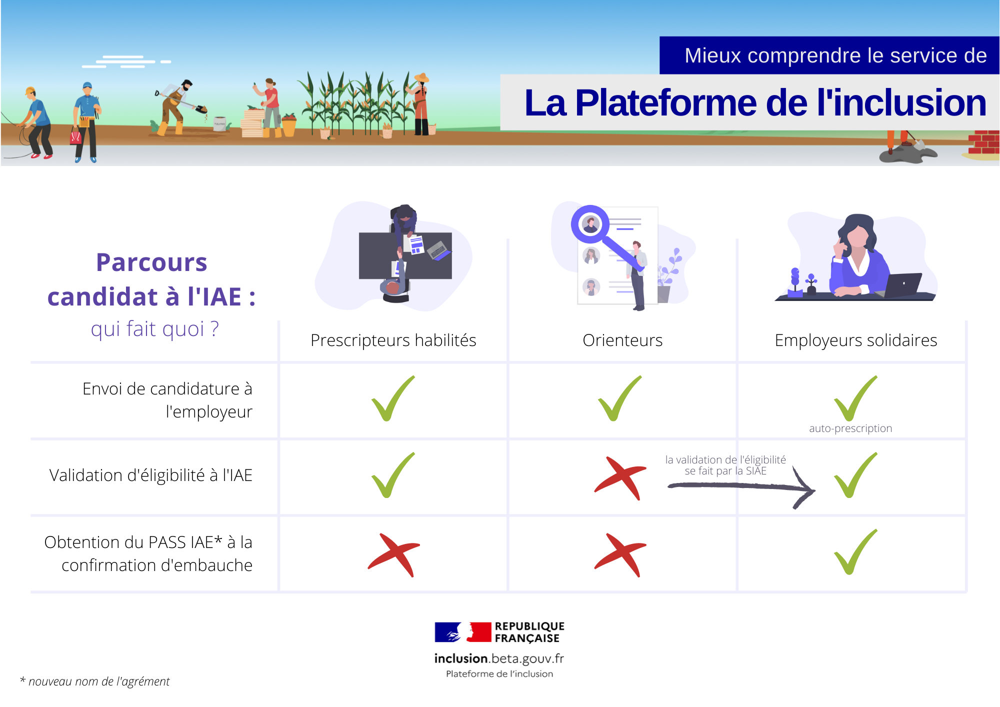

# 🏆Qui est éligible à l'IAE \(critères d'éligibilité & diagnostic\) ?

**Qui bénéficie du contrat d'Insertion par l'Activité Economique \(IAE\) :**

* Les **personnes** en **difficultés sociales et/ou professionnelles** \(précarité, âge, santé\)
* **Orientées par un** [**prescripteur habilité ou un orienteur** ](pourquoi-une-plateforme-de-linclusion/qui-sont-les-differents-prescripteurs/)vers une[ **SIAE**](pourquoi-une-plateforme-de-linclusion/qui-sont-les-employeurs-solidaires.md) \(Structure de l'IAE\)
* Ou **recrutées directement par une** [**SIAE**](pourquoi-une-plateforme-de-linclusion/qui-sont-les-employeurs-solidaires.md) ****\(validation de l'IAE\)
* Après un [**diagnostic socio-professionnel**](qui-est-eligible-iae-criteres-eligibilite.md#diagnostic_de_reference)\*\*\*\*
* Remplissant [**1 critère administratif de niveau 1**](qui-est-eligible-iae-criteres-eligibilite.md#criteres-administratifs-de-niveau-1), ou [**3 critères administratifs de niveau 2**](qui-est-eligible-iae-criteres-eligibilite.md#criteres-administratifs-de-niveau-2)\*\*\*\*

**L'éligibilité à l’IAE** du candidat ****ne peut être **validée sur la Plateforme** que par : 

* Les [**prescripteurs habilités**](pourquoi-une-plateforme-de-linclusion/qui-sont-les-differents-prescripteurs/prescripteur-habilite.md)\*\*\*\*
* Les [**SIAE**](pourquoi-une-plateforme-de-linclusion/qui-sont-les-employeurs-solidaires.md)\*\*\*\*

**Une fois l'embauche confirmée sur la Plateforme par une SIAE, le** [**Pass IAE** ](pourquoi-une-plateforme-de-linclusion/pass-iae-agrement-plus-simple-cest-a-dire.md)**est délivré par mail à l'entreprise sous ≈ 6 jours.**

Les [**GEIQ, EA, EATT**](pourquoi-une-plateforme-de-linclusion/qui-sont-les-employeurs-solidaires.md#comment-se-reperer-entre-les-differents-employeurs-solidaires) n’ont **pas besoin de** [**Pass IAE**](pourquoi-une-plateforme-de-linclusion/pass-iae-agrement-plus-simple-cest-a-dire.md) pour recruter un candidat. Ils ne sont pas soumis aux critères d'éligibilité.


Les candidats qui **ne répondent pas aux** [**critères d'éligibilité**](qui-est-eligible-iae-criteres-eligibilite.md#criteres-administratifs-de-niveau-1) ou ne peuvent respecter le **délai de carence de 2 ans** entre deux parcours, peuvent être **orientées vers un** [**prescripteur habilité**](pourquoi-une-plateforme-de-linclusion/qui-sont-les-differents-prescripteurs/prescripteur-habilite.md). Il est seul à pouvoir **prescrire un parcours IAE en dehors de ces obligations.**


### Critères administratifs de niveau 1

* **Bénéficiaire RSA \(socle\) :** sur attestation RSA
* **Allocataire ASS :** sur attestation ASS
* **Allocataire AAH :** sur attestation AAH
* **DETLD \(+ 24 mois de chômage\)** : sur attestation Pôle emploi

### Critères administratifs de niveau 2

* **Niveau d'étude 3 \(CAP, BEP\) ou infra** : sur justificatif diplôme ou attestation sur l'honneur
* **Senior \(+ 50 ans\) :** sur pièce d'identité
* **Jeunes \(- 26 ans\) :** sur pièce d'identité
* **Sortant de l'ASE** : sur attestation ASE
* **DELD \(12-24 mois de chômage\)** : sur attestation Pôle emploi
* **Travailleur en situation de handicap :** sur attestation reconnaissance qualité TSH
* **Parent isolé :** sur attestation CAF 
* **Personne sans hébergement / hébergée / ayant un parcours de rue :** attestation sur l'honneur
* **Personne récemment arrivée en France :** contrat d'intégration républicaine de - 24 mois
* **Résident** en [ZRR ](https://www.data.gouv.fr/fr/datasets/zones-de-revitalisation-rurale-zrr/): sur justificatif de domicile
* **Résident** [QPV](https://sig.ville.gouv.fr/) : sur justificatif de domicile


**ETTI : RÈGLE DE VALIDATION SPÉCIALE POUR LES ETTI**

La validation des critères d'éligibilité obéit désormais à une règle simplifiée pour toutes les structures ETTI :

**. 1 critère administratif de niveau 1** ou **2 critères administratifs de niveau 2**


\*\*\*\*

### Diagnostic socio-professionnel de référence 



| Vulnérable | ===============&gt; | ===============&gt; | ==========&gt; | Disponible |
| :--- | :--- | :--- | :--- | :--- |
| Maitrise de la langue française | Analphabète à illettré | Relève d'une formation FLE et/ou savoirs de base | Laborieuse à limitée | Bonne à parfaite |
| Capacité à occuper un poste de travail | Est dans l'incapacité immédiate d'occuper un poste de travail | A besoin d'un accompagnement avant de pouvoir occuper un poste de travail | Peut occuper un poste de travail dans des conditions aménagées | Peut occuper un poste de travail dans des conditions ordinaires |
| Logement | SDF | Hébergement collectif de type CHRS, CADA... | Hébergement hors structure sociale, logement insalubre, risque de perte de logement | Logement stable |
| Accès au droit | Ne connait pas ses droits, en situation de non recours | Renoncement ou en rupture ou difficulté de renouvellement de droits | Connait ses droits et démarches en cours | Bénéficie des droits afférents à sa situation |
| Mobilité | Ne sait pas se rendre seul à son lieu de travail | Sait organiser son covoiturage et/ou possède un véhicule mais problème de mise en règle \(assurance, contrôle technique…\) | Sait utiliser les transports en commun et/ou possède un véhicule 2 roues | Possède un véhicule et permis de conduire conformes et covoitureur possible |
| Ressources financières | Situation de surendettement sans dépôt de dossier et/ou sans ressources | Surendettement avec dossier déposé et suivi | Besoins primaires assurés au jour le jour et/ou mesure de protection type curatelle | Sait gérer son budget, avec capacité de financer par exemple un permis de conduire |
| Justice | Exécution de peine en cours | Suivi SPIP/PJJ après exécution de peine | Aucun suivi en cours | Aucun suivi en cours |
| Disponibilité | Faible voire difficile \(garde d'enfant, ascendant, famille\) | A organiser | Immédiate avec des contraintes horaires | Immédiate et sans contraintes horaires |

